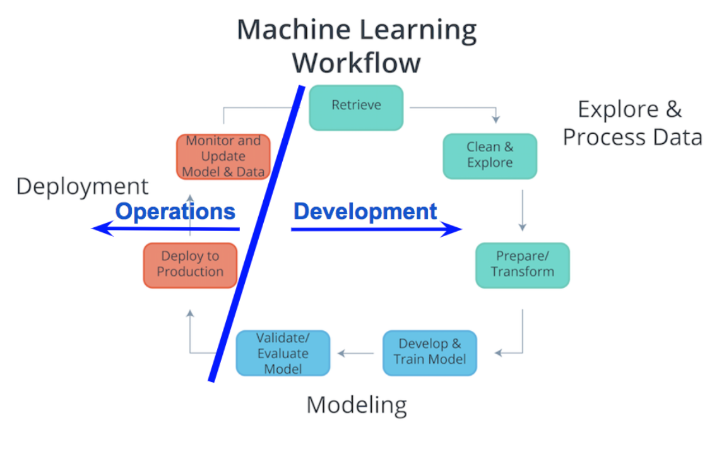
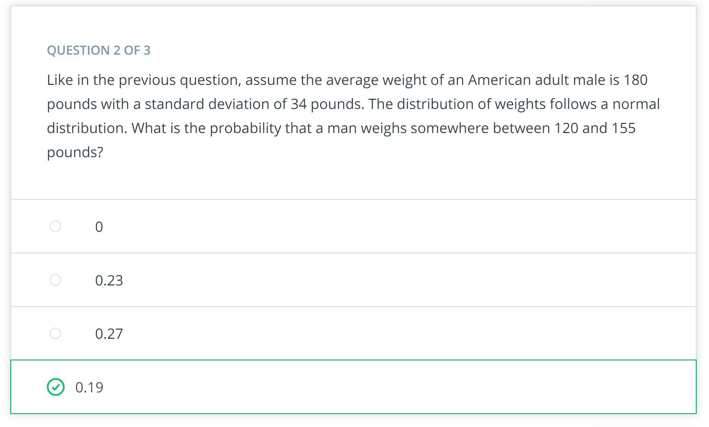

# Machine Learning Engineer

This repo contains my work to Udacity nanodegree [Machien Learning Engineer](https://www.udacity.com/course/machine-learning-engineer-nanodegree--nd009t).

## Table of Contents

* Software Engineering Fundamentals: Publish a simple [PyPi package](https://github.com/scumabo/Number-Guessing-Game) to practice software engineering fundamentals, e.g., modular code, optimize speed and memory, Docstrings, version control, unit tests, logging, and code review.

* [Machine Learning in Production](SentimentLSTM): Use Sagemaker to develop, train, validate, and deploy a sentiment analysis on movie review model using RNN in Pytorch. Hook the simple webapp with the deployed endpoint using Lambda and API Gateway services in AWS.

* Machine Learning, Case Studies

* Capstone Project

### TODO

